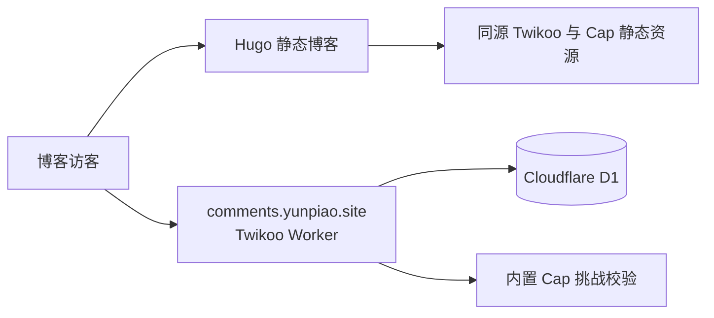

# 2026-10-04 博客评论迁移到 Cloudflare

状态：采用。

## 背景与选择

博客原来使用 Waline 客户端和 Vercel 上的 Waline 服务。旧管理端出现 LeanCloud 停服提示；LeanCloud 官方公告的停服日期为 2027-01-12。没有通过读取部署凭据确认旧实例实际使用的数据库，因此不能把提示等同于已确认的存储依赖。

改用 Twikoo 2.0.12 的官方 Cloudflare Workers 适配器与 D1。该版本提供匿名评论、回复、管理界面和内置 Cap 验证，无需访客登录 GitHub，也无需另行运行数据库服务器。Cloudflare 负责运行和存储；Twikoo 提供评论产品功能。

| 选项 | 对本博客的影响 | 判断 |
| --- | --- | --- |
| Waline + PostgreSQL | 保留原客户端，但还需维护一个新的 PostgreSQL 服务 | 本次不采用 |
| Giscus | 无需自建数据库，访客必须使用 GitHub 账号 | 不符合原有匿名留言习惯 |
| Twikoo + Workers + D1 | 可保留匿名留言，利用现有 Cloudflare 账号维护 | 采用 |

## 实现约束

- 上游固定为 Twikoo `2.0.12`，commit `d7a040b4ef85ae081d1838ed1470b8af163e17d4`；构建工具与依赖版本锁定。
- 通过有精确匹配检查的构建补丁移除请求体、响应体、IP 的日志输出，保留事件、请求编号和错误诊断。
- Cloudflare 入口在启动时初始化一次 DOMPurify，并在每次平台依赖注入时复用；保留官方同步清洗逻辑，避免每条留言重新创建 JSDOM。并发复用、逐次配置隔离与 XSS 测试均覆盖此补丁。
- 前端固定 Twikoo、Cap widget 与 WASM 版本并同源提供，避免运行时依赖未固定版本的第三方 CDN。
- 评论标识使用原站 URL pathname，保留原评论 ID、作者信息、时间、置顶和回复关系；导入 HTML 必须清洗。
- Cap 由服务端验证，缺失、错误和重复使用的凭据均拒绝；前端配置加载失败时保留明确错误和刷新入口。
- 未开通新的付费计划；免费额度不足时请求可能失败，不自动升级或切换其他存储。

## 迁移边界

| 数据 | 处理 |
| --- | --- |
| 110 条评论，13 个页面 | 导入 D1，保留 13 条回复的父级与根评论关系 |
| 4 个原用户账号 | 保留于私密备份，作者资料用于评论展示；不迁移旧账号密码和登录状态 |
| 4 次历史点赞 | 保留于备份与评论私有扩展字段；Twikoo 点赞重新计数 |
| 13 条原反应计数记录 | 保留备份，不误转换为文章浏览量 |
| 管理员 | 独立生成强口令，口令仅保存在本机受限目录 |
| 邮件通知 | 博主通知使用 Cloudflare 原生邮件绑定；访客回复邮件待付费订阅确认，见[邮件通知决策](2026-10-04-评论邮件通过Cloudflare绑定发送.md) |

保留旧服务及完整导出，便于回滚。测试评论放在独立测试路径，验证后标记为垃圾评论，不混入公开历史。

## 资料与运维

- [LeanCloud 停服公告](https://docs.leancloud.app/en/sdk/announcements/sunset-announcement/)
- [Twikoo 官方 Cloudflare 适配器](https://github.com/twikoojs/twikoo/tree/2.0.12/packages/server-cloudflare)
- [Cloudflare CPU 限制](https://developers.cloudflare.com/workers/platform/limits/#cpu-time)
- [Cloudflare CPU 结转说明](https://developers.cloudflare.com/workers/observability/metrics-and-analytics/#cpu-time-per-execution)
- [部署与恢复说明](../../services/comments/2026-10-04-部署与恢复说明.md)
